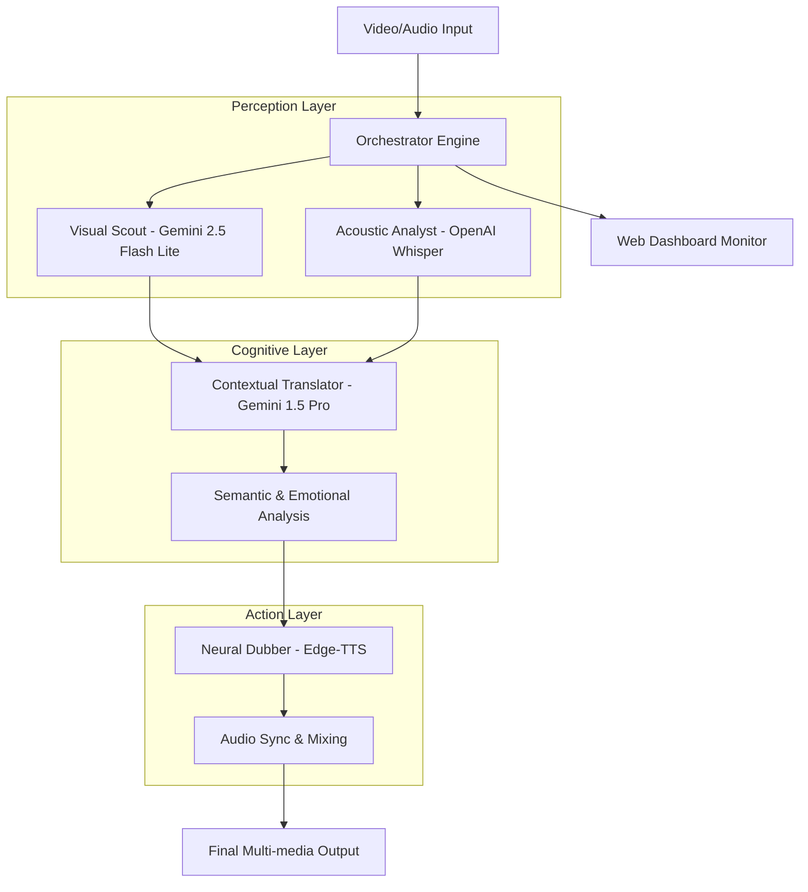

# 🏗️ MIMO-AXON: Kiến trúc Hệ thống & Luồng phối hợp Tác nhân

Hệ thống **MIMO-AXON** được xây dựng trên mô hình **Distributed Multi-Agent Architecture**, nơi các tác nhân AI chuyên biệt phối hợp thông qua một lớp điều phối trung tâm.

---

## 1. Sơ đồ Kiến trúc (System Architecture)

---

## 2. Giải trình Luồng phối hợp (Agent Interaction)

### 2.1 Visual & Acoustic Fusion
Thay vì xử lý tuần tự, **Visual Scout** và **Acoustic Analyst** hoạt động song song. 
- Nếu video có phụ đề, Visual Scout sẽ cung cấp khung thời gian (Timestamps) và nội dung chữ. 
- Acoustic Analyst sẽ đối soát với âm thanh thực tế để tinh chỉnh Timestamps đến độ chính xác mili giây (0.001s).

### 2.2 Context-Aware Translation (CoT)
Module **Contextual Translator** thực hiện suy luận qua 3 bước (Chain-of-Thought):
1.  **Hiểu bối cảnh:** Đọc toàn bộ kịch bản thô của phân đoạn 5 phút để xác định chủ đề và mối quan hệ giữa các nhân vật.
2.  **Dịch thuật ngữ nghĩa:** Chuyển đổi sang ngôn ngữ đích, bảo toàn sắc thái văn hóa và thuật ngữ chuyên ngành.
3.  **Tối ưu hóa thời lượng:** Điều chỉnh câu chữ sao cho khi chuyển sang TTS, độ dài âm thanh không vượt quá thời gian cho phép của khung hình video.

### 2.3 Neural Dubbing & Sync
**Neural Dubber** không chỉ đơn thuần là đọc chữ. Tác nhân này nhận các chỉ thị cảm xúc từ lớp Cognitive:
- Tự động thay đổi Voice ID dựa trên định danh người nói (Speaker ID).
- Điều chỉnh Pitch (cao độ) và Rate (tốc độ) theo thời gian thực để khớp với nhịp điệu của diễn viên gốc.

---

## 3. Quản lý Trạng thái (Shared State Management)

Hệ thống sử dụng một **Shared Buffer** để lưu trữ trạng thái của quá trình xử lý:
- **Video Metadata:** Độ phân giải, FPS, độ dài.
- **Agent Logs:** Nhật ký xử lý từng giây để Dashboard hiển thị Real-time.
- **Token Usage:** Theo dõi sát sao lượng token tiêu thụ của từng Agent để tối ưu hóa chi phí.

---
**MIMO-AXON: Tương lai của xử lý đa phương tiện tự động hóa.**
